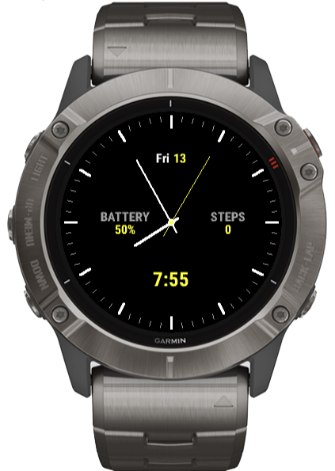

# Analooog

A clean analog watchface for the Garmin Fenix 6X Pro.



## Features

- Analog clock with hour, minute, and second hands
- Tick marks for hours (white) and minutes (gray)
- Day and date display near 12 o'clock
- Battery percentage (left) and step count (right)
- Digital time near 6 o'clock (12h/24h aware)
- Second hand appears on wrist raise, hides on sleep

## Requirements

- [Connect IQ SDK](https://developer.garmin.com/connect-iq/sdk/)
- [Monkey C VS Code extension](https://marketplace.visualstudio.com/items?itemName=garmin.monkey-c)

## Build

1. Open the project in VS Code
2. Cmd+Shift+P → **Monkey C: Build for Device** → select Fenix 6X Pro

## Run in Simulator

### From VS Code

1. Cmd+Shift+P → **Monkey C: Build for Device** → select Fenix 6X Pro
2. The simulator launches automatically with the watchface loaded

### From Command Line

Add the SDK to your PATH (or add to `~/.zshrc` to make permanent):

```bash
export PATH="$HOME/Library/Application Support/Garmin/ConnectIQ/Sdks/connectiq-sdk-mac-9.1.0-2026-03-09-6a872a80b/bin:$PATH"
```

Then launch the simulator and load the watchface:

```bash
connectiq
monkeydo analooog.prg fenix6xpro
```

## Deploy to Watch

1. Set USB Mode on your watch: **Menu → System → USB Mode → MTP**
2. Connect the watch to your Mac via USB
3. Use [OpenMTP](https://openmtp.ganeshrvel.com/) or similar to browse the watch filesystem
4. Copy the built `.prg` file to `GARMIN/Apps/`
5. Disconnect the watch
6. Long-press the watch face → **Change Watch Face** → select Analooog
